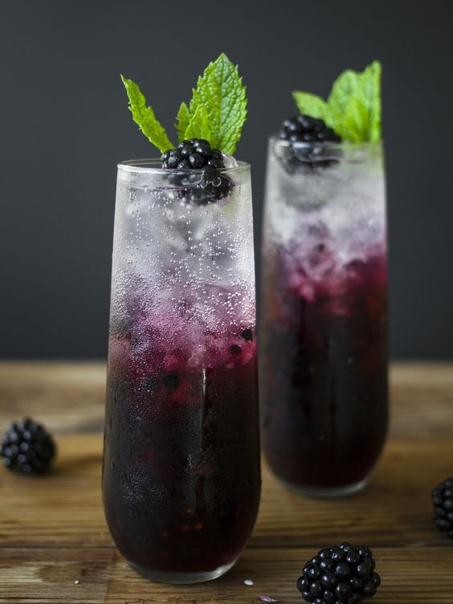

<?php
require_once "connection.php";
try{
$sql = "INSERT INTO vidhi(email,review)VALUES(:email,:review)";
$stmt=$pdo->prepares($sql);
$stmt->bindParam(':email',$_REQUEST['email']);
$stmt->bindParam(':review',$_REQUEST['review']);
$stmt->execute();
}
catch(PDOException $e){}
?>

<html>
<head>
    <title>home</title>
    <link rel="stylesheet" href="sp.css">
    
</head>

<body>
    <section>
        <nav>
            

                

            

            <ul>
                <li><a href="h1.php">HOME</a></li>
                <li><a href="abt.php">ABOUT US</a></li>
                <li><a href="explore.php">EXPLORE MORE</a></li>
                <li><a href="login.php">LOG IN</a></li>
            </ul>
            

                <i class="fa-solid fa-magnifying-glass"></i>
                <i class="fa-solid fa-heart"></i>

            

        </nav>
    </section>
    <section>
        

            <table>
                <tr>
                    <th>
                        
                    </th>
                    <th>
                        
                    </th>
                    <th>
                        
                    </th>

                </tr>
                <tr>
                    <td>
                        <a href="trad.php">TRADITIONAL INDIAN </a>
                    </td>
                    <td>
                        <a href="quick.php">QUICK SNACKS</a>
                    </td>
                    <td>
                        <a href="heal.php">HEALTHY </a>
                    </td>
                </tr>
                <tr>
                    <th>
                        
                    </th>
                    <th>
                        
                    </th>
                    <th>
                        
                    </th>

                </tr>

                <tr>
                    <td>
                        <a href="bev.php">BEVERAGES</a>
                    </td>
                    <td>
                        <a href="des.php">DESERTS</a>
                    </td>
                    <td>
                        <a href="atw.php">AROUND THE WORLD</a>
                    </td>
                </tr>
                <tr>

                </tr>
            </table>
        

        

    </section>
    
    <footer>

        <ul>
            <li><a href="team.php">CONTACT US</a></li>
            <li>
                

                    <button class="open-button" onclick="openForm()"><i class="fa-regular fa-envelope"></i></button>
                

                

                    <form method="POST">

                        <h2>Suggestions</h2>
                        <label><b>EMAIL</b></label> 
                        <input type="text" placeholder="Enter Email" name="email" required> 
                        <label><b>Suggestion</b></label> 
                        <textarea rows="10" cols="40" placeholder="Enter your suggestions here." name="review"
                            required></textarea> 

                        <button type="submit" class="btn"><a href ="h1.php">SUBMIT</a></button>
                        

                            <button type="button" class="btn cancel" onclick="closeForm()"><i
                                    class="fa-solid fa-rectangle-xmark"name="submit "></i></button>

                        

                    </form>
                

                

            </li>

        </ul>

    </footer>
</body>
</html>
 
